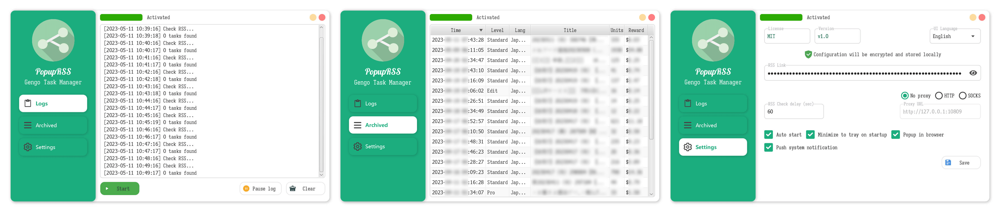

# PopupRSS

PopupRSS is a **UNOFFICIAL** simple RSS monitor for Gengo, a crowdsourced translation platform.

It can run in the background and directly popup in the browser when a new job is available in your feed.

## Features

- [x] Check for available jobs down to every 60 seconds.
- [x] Popup new job in the browser immediately.
- [x] Push job details through system notifications.
- [x] Archive all jobs data in CSV file.
- [x] Connect directly or via HTTP/SOCKS proxy.
- [ ] Filter by job keyword, level, reward.

## Getting Started

1. Download the latest release from [here](https://github.com/hoywu/PopupRSS/releases) and install it.
2. Run `PopupRSS.exe` in the installation directory or start it from the shortcut.
3. Get your RSS feed URL from Gengo dashboard.
4. Paste the URL into `Settings - RSS Link` and click `Start` button.
5. Click the yellow minimize button in the upper right corner to minimize to the system tray.
6. When a new job is available, you will receive a system notification and the browser will popup automatically.

## Known issues

- Because of the UI animation, you may experience performance issues if GPU acceleration is not available.
  This issue should not affect the functionality of the RSS monitor.
    - Minimizing the application to system tray will minimize resource usage, and you can
      enable `Minimize to tray on startup` in `Settings`.

## License

This project is licensed under the MIT License.

## Donate

If you like this project, please consider donating to support the development.

**Or give me a free star ⭐️ to encourage me!**

## Credits

- [palexdev/MaterialFX](https://github.com/palexdev/MaterialFX) - Material Design components for JavaFX
- [ByteDance IconPark](https://iconpark.oceanengine.com/) - Icon resource
- [FLAT ICON DESIGN](http://flat-icon-design.com/) - Beautiful Icon
